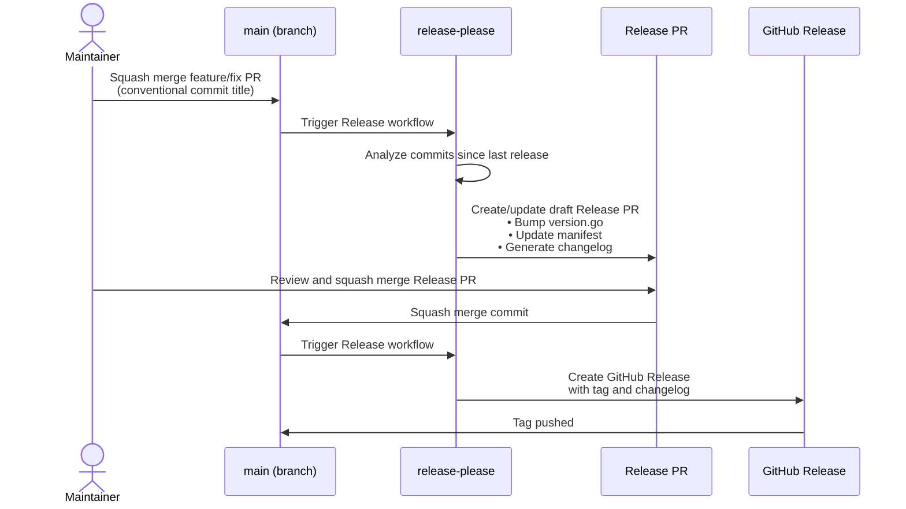
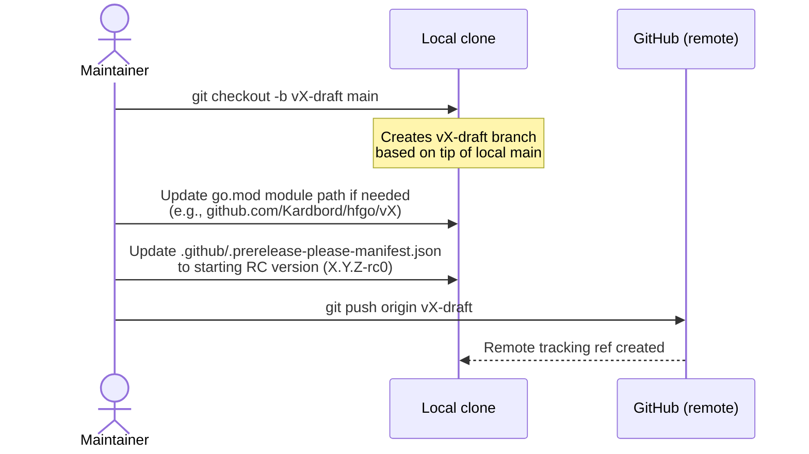
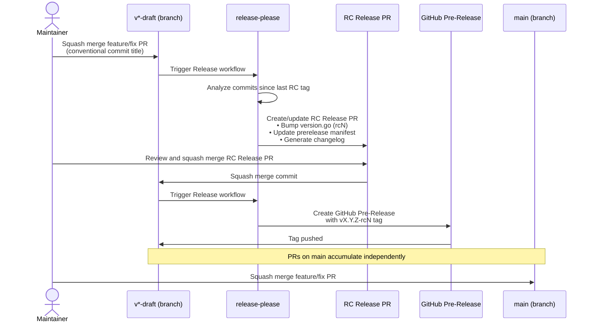
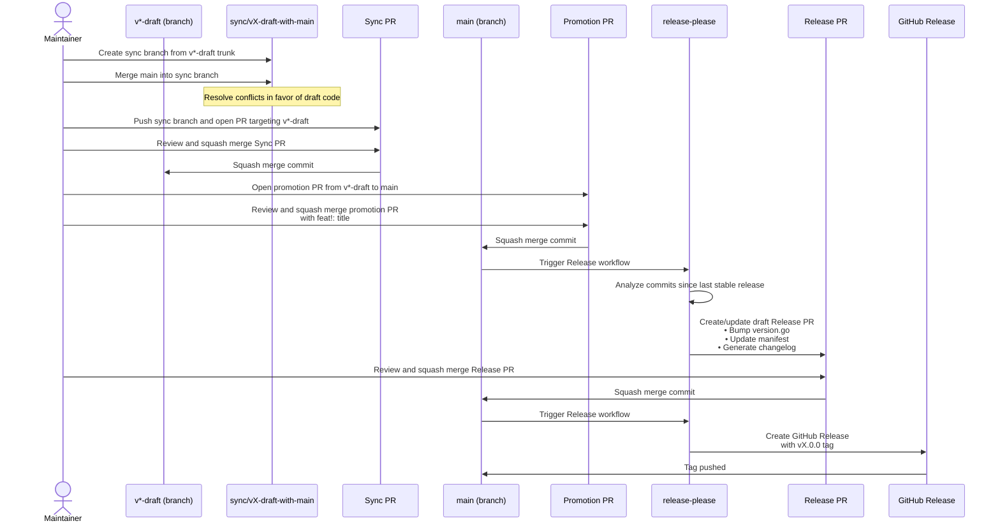

# Release Process

## Overview

hfgo uses an automated release workflow driven by
[release-please](https://github.com/googleapis/release-please)
in **manifest mode** and
[Conventional Commits](https://www.conventionalcommits.org/).

There are two tracks:

- **Mainline releases**: Patch and minor releases from `main`
- **Release candidate (RC) releases**: Major or significant releases from a
  dedicated draft branch

The workflow uses **separate configuration files** for stable and prerelease
runs, selected programmatically based on the branch name. This avoids the
need for draft branches to recreate or modify configuration.

---

## Configuration Files

All configuration files live on all branches. The
[`Release` workflow](../.github/workflows/release.yml) reads the current branch
name from `github.ref_name` and sets the `config-file` and `manifest-file`
inputs on the `release-please-action` step accordingly. When running on `main`
it selects the stable pair; when running on a `v*-draft` branch it selects the
prerelease pair.

### Stable Config

| File | Purpose |
|------|---------|
| `.github/release-please-config.json` | Stable release-please config |
| `.github/.release-please-manifest.json` | Tracks last stable version |

### Prerelease Config

| File | Purpose |
|------|---------|
| `.github/prerelease-please-config.json` | Prerelease config with `prerelease: true`, |
| `.github/.prerelease-please-manifest.json` | Tracks last RC version |

Both config files use the `packages` key (manifest mode) and include the
same base options (`release-type: go`, `version-file`, `versioning`,
`pull-request-footer`, etc.). The prerelease-specific versioning strategy
(`versioning: prerelease`) and related flags (`prerelease`, `prerelease-type`)
differ.

The `pull-request-footer` is set on both tracks to warn maintainers that the
PR title and body are load-bearing for version calculation and changelog
generation, and should not be manually edited.

release-please automatically updates the `Version` const in
`internal/sdkversion/version.go` via the `go` release-type's version-file
updater.

The workflow sets both the `config-file` and `manifest-file` action inputs
on `release-please-action` for every run. The `manifest-file` input is
required because the action's default manifest path is
`.release-please-manifest.json` at the repository root, but this project
stores both config and manifest files under `.github/`.

### Why Separate Manifests?

Each branch reads its own manifest file. This provides **structural version
isolation**: the draft branch's RC versions never interfere with main's
stable version baseline, and vice versa.

Because both manifest files exist on all branches, a stale stable manifest
(created when the draft branch was cut from `main`) naturally carries the
correct stable baseline. During promotion, no manifest reset is needed.

---

## Mainline Releases

### Trigger

Pushes to `main` trigger the [`Release` workflow](../.github/workflows/release.yml).
The workflow selects the **stable** config/manifest pair.

### Mainline Workflow

1. Maintainers merge PRs to `main` using squash merge.
2. PR titles follow Conventional Commits (enforced by `pr-title-check.yml`).
3. release-please analyzes commits since the last stable release.
4. A **draft release PR** is created/updated on `main` with:
   - Updated version in `internal/sdkversion/version.go`
   - Updated `.github/.release-please-manifest.json`
   - Auto-generated changelog
5. A maintainer reviews and merges the release PR when ready.
6. release-please creates a GitHub release with the tag and changelog.

<details>

<summary>Mainline Workflow Sequence Diagram</summary>



</details>

### Version Determination

| Bump  | Trigger                                     |
|-------|---------------------------------------------|
| Major | Breaking change (`feat!:` or `fix!:` title) |
| Minor | New feature (`feat:`)                       |
| Patch | Bug fix (`fix:`) or refactoring             |
| None  | Documentation, tests, chore                 |

---

## Release Candidate (RC) Releases

### When to Use

For major version upgrades or significant changes that need testing before a
formal release.

### Branch Convention

- **Major revision**: `vX-draft` (e.g., `v5-draft`)
- **Minor version**: `vX.Y-draft` (e.g., `v5.1-draft`)
- **Patch version**: `vX.Y.Z-draft` (e.g., `v5.1.1-draft`)
  - Note: patches should rarely, if ever, justify tracking a separate
    release-candidate branch

### Setup

1. Create the draft branch from `main`:

   ```bash
   git checkout -b vX-draft main
   ```

1. Update `go.mod` to the new module path if needed.
   (e.g., `github.com/Kardbord/hfgo/vX`).
1. Update `.github/.prerelease-please-manifest.json` with the starting RC version:

   ```json
   {
     ".": "X.Y.Z-rc0"
   }
   ```

1. Update `internal/sdkversion/version.go` with the starting RC version:

   ```go
   const Version = "X.Y.Z-rc0"
   ```

1. Commit the version updates, then push the branch.

<details>

<summary>Branch Creation Sequence Diagram</summary>



</details>

The stable manifest (`.github/.release-please-manifest.json`) remains at the
last stable version from `main`. It is unused on the draft branch but
preserved for promotion.

> **Warning:** Do not manually modify `.github/.release-please-manifest.json`
> on the draft branch. It must stay at the last stable version for the
> promotion step to work correctly. If the stable manifest is accidentally
> bumped (e.g., by running release-please on the draft branch with the wrong
> config file), reset it from `main` before promoting.

### RC Workflow

Pushes to `v*-draft` trigger the same `Release` workflow, which selects the
**prerelease** config/manifest pair.

1. PRs merged to the draft branch accumulate conventionally.
1. release-please bumps the pre-release version (`rc1`, `rc2`, ...).
1. Each merge of the RC release PR creates a GitHub **pre-release** with a
   `vX.Y.Z-rcN` tag.
1. `main` continues to receive patches and minor updates independently.

<details>

<summary>RC Workflow Sequence Diagram</summary>



</details>

### Keeping the Draft Branch in Sync

GitHub rulesets require that `v*-draft` branches be up to date with `main`
before any PR can be merged. To sync changes from `main` into the draft
branch, maintainers must use a PR-based workflow:

1. Create a sync branch from the `v*-draft` trunk:

   ```bash
   git fetch
   git checkout vX-draft
   git checkout -b sync/vX-draft-with-main
   ```

1. Merge `main` into the sync branch and resolve any conflicts in favor of
   the draft branch's code:

   ```bash
   git merge origin/main
   ```

1. Push the sync branch and open a PR targeting `v*-draft`.
1. Squash merge the sync PR after review.

### Promoting an RC to a Formal Release

When the RC is stable:

1. Ensure the final RC PR is merged so the release candidate tag reflects all
   desired changes.
1. Optional: if this is a major revision, deprecate the previous major version
   in `doc.go` and perform a final patch release so that the deprecation is
   reflected by the go module proxy.
1. Bring the draft branch up to date with `main` using the
   [PR-based sync workflow](#keeping-the-draft-branch-in-sync):
   - Create a sync branch from the `v*-draft` trunk, merge `main` into it,
     resolve conflicts in favor of the draft branch's code, then open and
     squash merge a PR back to `v*-draft`.
   - This ensures the promotion PR contains all fixes and minor features that
     landed on `main` during the RC phase.
1. Create a promotion PR from the draft branch to `main`.
   - Resolve any merge conflicts in favor of the draft branch's code changes.
   - The stale `.github/.release-please-manifest.json` (still at the last
     stable version from `main`) should be kept as-is.
1. **Squash merge** the promotion PR to `main` with a conventional commit
   title that signals a breaking change, e.g.:

   ```text
   feat!: release v5.0.0
   ```

   **Important:** GitHub's default squash message (`Merge pull request #123
   from v5-draft`) will be ignored by release-please. The merge author must
   write a proper `feat!:` or `fix!:` title.

1. release-please on `main`:
   - Reads the stable manifest (still at the last stable version, e.g., `4.0.0`)
   - Sees the new commit: `feat!: release v5.0.0`
   - Computes the next version: `4.0.0 + feat! → 5.0.0`
   - Creates a release PR for `v5.0.0`

1. A maintainer merges the release PR.
1. release-please creates the GitHub release with the `v5.0.0` tag.

<details>

<summary>Promotion Workflow Sequence Diagram</summary>



</details>

---

## Version Coordination & Gotchas

### Config Files on All Branches

Both `release-please-config.json` and `prerelease-please-config.json` exist
on all branches. The workflow selects the correct one at runtime. There is no
need for draft branches to create or modify their own config.

### Manifest Isolation

| Branch | Manifest Used | Typical Contents |
|--------|---------------|------------------|
| `main` | `.release-please-manifest.json` | `{ ".": "4.0.0" }` |
| `v5-draft` | `.prerelease-please-manifest.json` | `{ ".": "5.0.0-rc3" }` |

Each manifest is branch-specific. The stable manifest on a draft branch is
stale (carried from when the branch was created) but preserved for promotion.

### go.mod on Draft Branches

The `go.mod` major version on the draft branch may be different from `main`.
This is intentional — the validation workflow (`validate-release-pr.yml`)
verifies the match, and maintainers resolve it on merge.

### Changelog Overlap

Fixes merged from `main` into the draft branch will appear in both changelogs.
This is acceptable — the same commit fixed the same issue in both tracks.
